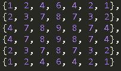
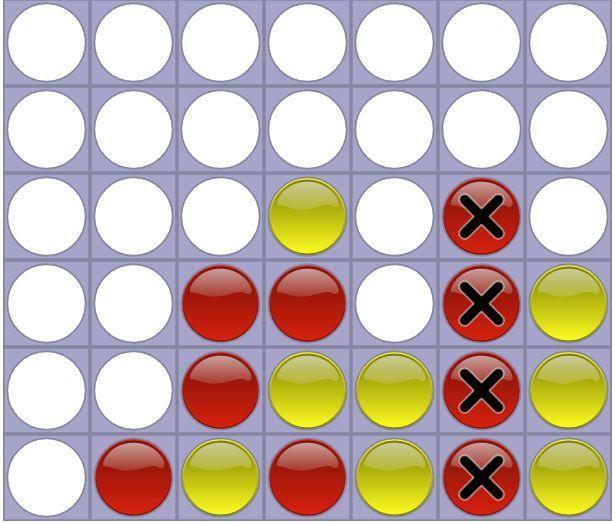

Java program that implements a Connect Four computer.
There are two programs the computer is based on:
1. The minimax algorithm, and the file is called minimax_a_dot_out.java
2. The alpha beta pruning algorithm, and the file is called alphabeta_a_dot_out.java

To compile the programs, use the command: java *.java
You will also need X11 display. If you are connecting to a remote computer through PuTTy, you need to enable X11 port forwarding in the settings and also download Xming and have it open when you connect remotely.

The command to run the program is: java Main -p1 (player1) -p2 (player2), where player1 and player2 are the user chosen AI. You can also leave the player arguments out and a player will take over those positions. 
Provided in this repository are sample AI: RandomAI, StupidAI, and MonteCarloAI.
Our created AI are minimax_a_dot_out and alphabeta_a_dot_out.

Below is a description of the general algorithm we used and how it works:

Our evaluation function is based on the threats on the board.

If our player has four coins in a horizontal, vertical, or diagonal line, we win, so we weight this win condition with a giant payoff so our AI goes towards these win states. Conversely, if the opponent has four in a row, we lose, so we weight this loss condition with a very bad payoff so the AI avoids these loss states.

We then check for open ended two in a rows. Since an open ended two coins in a row can lead to an open ended three in a row which is a guaranteed win or loss, we weight this state heavily to deal with the potential threat immediately. Moreover, open ended two in a rows can eventually lead to three in a row threats even when blocked on one side, further justifying our heavy weight on this condition. This is weighed less than imminent losses, but out of everything else this is weighed the most.

We then check for three coins on the same diagonal. Since these states can lead to wins with the 4th coin in the diagonal, we weight these states to head towards them and block our opponent from getting them. However, since diagonals are harder to build and complete than open ended two in a rows, we weight this state less heavily than open ended two in a rows. Essentially, they are less of a potential threat, but more of a threat than just the regular positional weights.

Finally, we weight the positions of the board. The weights of the positions are based on the number of threats they can create, so the center is weighted the most and the weights radially decrease outwards from the center. Since controlling the center can generate the most threat and thus increase the chance of winning, we weight these positions to entice our AI to capture these squares.

Thus, the player who has more winning lines, then open ended two in a rows, then three in a diagonal, and then coins in key positions on the board is in a better state, which encompasses the threats of Connect Four. Our minimax uses these cases.

Eval(state) = ((ourWins - enemyWins) * (winWeight)) + ((ourTwoInRow - enemyTwoInRow) * (twoHorzWeight)) + ((our3Diag - enemy3Diag) * threeDiagWeight) + ((ourWeight - enemyWeight))

ourWins= number of our player’s 4 coins in a line. enemyWins= number of enemy player’s 4 coins in a line. winWeight = 10000000

ourTwoInRow= number of our player’s open ended 2 coins in a row. enemyTwoInRow= number of enemy player’s open ended 2 coins in
a row.

twoHorzWeight = 10000

our3Diag = number of ways our player has 3 in a row diagonally enemy3Diag = number of ways enemy player has 3 in a row diagonally threeDiagWeight = 1000

ourWeight = Cumulative weight of positions our player occupies based on table weights shown above, enemyWeight = Cumulative weight of positions enemy player occupies based on on table weights shown above.

Example:

For this board state, we have one win, one open ended two in a row, one three in a diagonal line, and positions on the board. The enemy has zero wins, zero open ended two in a rows, zero three in a diagonal lines, and positions on the board.

Thus our payoff for this state would be:

((1 - 0) * (10000000)) + ((1 - 0) * (10000)) + ((1 - 0) * (1000)) +

((2 + 7 + 8 + 9 + 6 + 2 + 3 + 7 + 7) - (4 + 8 + 7 + 4 + 9 + 4 + 2 + 1)) = 10000000 + 10000 + 1000 + ((51) - (38)) = 10011013. This is a huge payoff in comparison to other possible states, so our AI loves this state and makes its move there!

